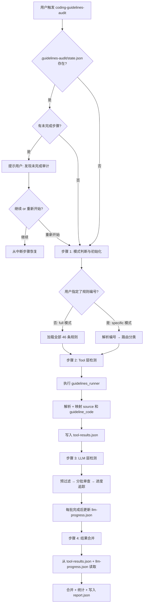
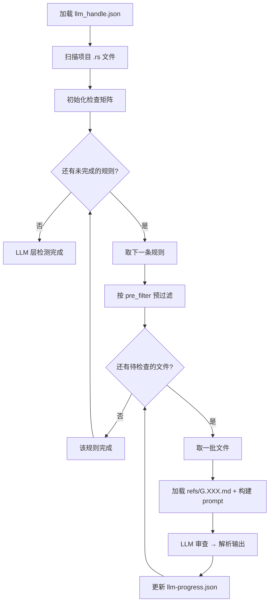
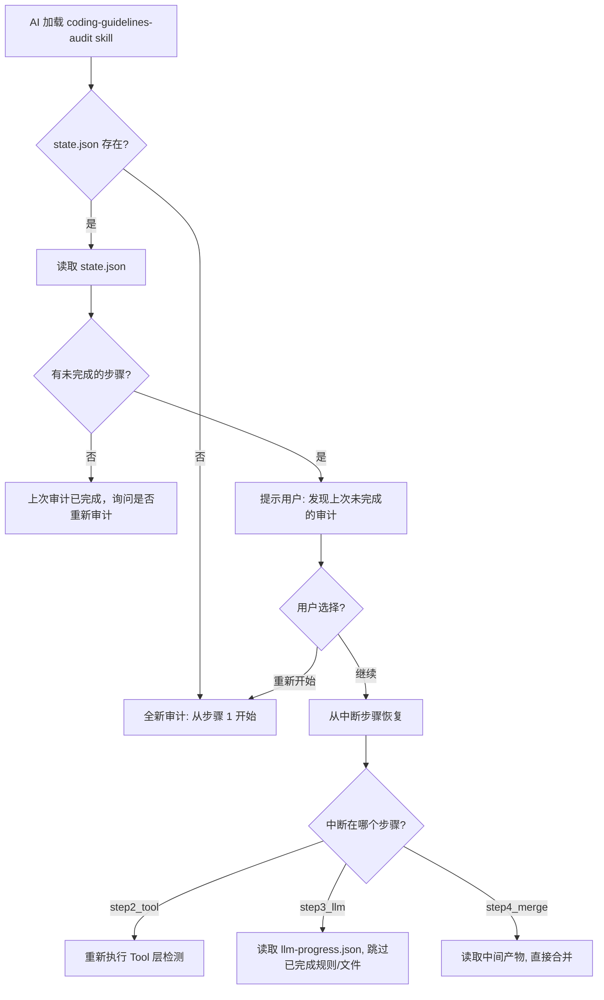

# Rust Coding Guidelines Skills 架构设计

> 基于 [idea.md](../idea.md) 的设计构想，构建一套 **静态工具 + LLM 辅助检测** 的 Rust 编程规范检查 Skills 体系。
> 重构后采用统一的 [`coding-guidelines-audit`](../skills/coding-guidelines-audit/SKILL.md) Skill，支持全量/定向两种模式，具备中间产物持久化和断点续审能力。

---

## 1. 整体架构

### 1.1 核心理念

将 57 条 Rust 编程规范分为三层处理：

| 层级 | 处理方式 | 条目数 | 说明 |
|------|---------|--------|------|
| **Tool 层** | `guidelines_runner` 静态检测 | 37 条 | 21 Clippy 原生 + 16 Fork 自定义 |
| **LLM 层** | 大模型代码审查 | 9 条 | 工具无法覆盖的规则类条目 |
| **排除层** | 不检测 | 11 条 | 原则类条目，仅作参考 |

### 1.2 工作流概览



---

## 2. 目录结构

### 2.1 Skill 目录

```
guideline-skills/
├── skills/
│   └── coding-guidelines-audit/          # 统一的审计 Skill
│       ├── SKILL.md                      # Skill 定义（~260 行）
│       ├── assets/
│       │   ├── tool_handle.json          # 37 条静态工具路由表
│       │   ├── llm_handle.json           # 9 条 LLM 检测路由表
│       │   └── output_schema.json        # 统一输出 schema
│       └── refs/
│           ├── rust_coding_guidelines.md # 完整 Rust 编程规范文档
│           ├── G.CMT.02.md              # 文件头注释应包含版权说明
│           ├── G.CTF.01.md              # 宜优先使用模式匹配
│           ├── G.CTF.02.md              # Match Guard 不应有副作用
│           ├── G.FMT.01.md              # extern 应显式指定 ABI
│           ├── G.MAC.DCL.01.md          # 宏匹配范围从小至大
│           ├── G.MAC.PRO.011.md         # 过程宏不应包装 unsafe
│           ├── G.SAF.MEM.04.md          # 敏感信息使用后清零
│           ├── G.TYP.BOL.03.md          # && || 右侧不应有副作用
│           └── G.TYP.SCT.01.md          # 自定义类型宜实现常见 trait
├── plans/
│   ├── architecture.md                  # 本文档
│   ├── refactor-plan.md                 # 重构计划
│   └── data/                            # 参考数据
└── idea.md                              # 原始构想
```

### 2.2 运行时工作目录

审计过程中在**目标项目**中生成 `.guidelines-audit/` 目录，用于中间产物持久化：

```
<目标项目>/
└── .guidelines-audit/
    ├── state.json            # 审计总状态（断点续审核心）
    ├── tool-results.json     # Tool 层检测结果（步骤 2 产物）
    ├── llm-progress.json     # LLM 层检查进度和中间结果（步骤 3 产物）
    └── report.json           # 最终审计报告（步骤 4 产物）
```

> ⚠️ `.guidelines-audit/` 目录应加入目标项目的 `.gitignore`。

---

## 3. 路由表设计

### 3.1 tool_handle.json

静态工具路由表（[`assets/tool_handle.json`](../skills/coding-guidelines-audit/assets/tool_handle.json)），包含 37 条可由 `guidelines_runner` 检测的规则。

**字段说明：**

| 字段 | 类型 | 说明 |
|------|------|------|
| `guideline_code` | string | 规范编号，如 `G.NAM.01` |
| `title` | string | 规范标题 |
| `level` | string | 级别：`requirement` / `suggestion` |
| `source` | string | 实现来源：`clippy_native` / `fork_custom` |
| `lint_codes` | string[] | 对应的 clippy/rustc lint 代码列表 |
| `handler` | string | 固定为 `"tool"` |

`source` 字段用于映射到最终报告的诊断来源（详见 [第 10 节](#10-诊断来源source三分类设计)）。

### 3.2 llm_handle.json

LLM 处理路由表（[`assets/llm_handle.json`](../skills/coding-guidelines-audit/assets/llm_handle.json)），包含 9 条需要大模型检测的规则。

**字段说明：**

| 字段 | 类型 | 说明 |
|------|------|------|
| `guideline_code` | string | 规范编号 |
| `title` | string | 规范标题 |
| `level` | string | 级别：`requirement` / `suggestion` |
| `difficulty` | string | 检测难度：`low` / `medium` / `high` |
| `handler` | string | 固定为 `"llm"` |
| `ref_file` | string | 参考规范文件的相对路径 |
| `check_strategy` | string | 检查策略标识 |
| `check_description` | string | 给 LLM 的检查指令描述 |
| `audit_focus` | string | **一句话审查聚焦点**（新增） |
| `pre_filter` | object | 预过滤配置（`type` + 类型特定参数） |
| `batch_size` | integer | 每批审查的文件数 |

**`audit_focus` 字段**为重构新增，提供一句话描述审查聚焦点，例如：
```json
{ "audit_focus": "文件头部是否包含版权声明注释" }
```

**`pre_filter` 类型说明：**

| type | 说明 | 参数 |
|------|------|------|
| `head` | 提取文件头部 N 行 | `lines`: 行数 |
| `grep` | 正则搜索匹配文件 | `patterns`: 正则列表, `context_lines`: 上下文行数 |
| `crate_type` | 按 crate 类型过滤 | `types`: crate 类型列表 |

---

## 4. 统一输出 Schema

所有检测结果统一输出为 JSON 格式（[`assets/output_schema.json`](../skills/coding-guidelines-audit/assets/output_schema.json)）。

### 4.1 顶层结构

| 字段 | 类型 | 说明 |
|------|------|------|
| `projectPath` | string | 被检测项目的绝对路径 |
| `checkMode` | `"full"` \| `"specific"` | 检测模式 |
| `checkedRules` | string[] | 本次检测涉及的规范编号列表 |
| `summary` | object | 统计摘要 |
| `diagnostics` | array | 诊断条目数组 |

### 4.2 summary 结构

```json
{
  "total": 30,
  "errors": 2,
  "warnings": 28,
  "by_source": {
    "tool_native": 15,
    "tool_custom": 10,
    "llm": 5
  }
}
```

使用 `by_source` 对象按三种诊断来源分类统计，替代旧版的 `tool_diagnostics` / `llm_diagnostics` 扁平字段。

### 4.3 diagnostics 条目

| 字段 | 类型 | 必填 | 说明 |
|------|------|------|------|
| `level` | `"error"` \| `"warning"` \| `"note"` | ✅ | 诊断级别 |
| `code` | string | ✅ | lint 代码，如 `clippy::collapsible_if` |
| `guideline_code` | string | | 对应的规范编号，如 `G.NAM.01`（未映射时留空） |
| `source` | `"tool_native"` \| `"tool_custom"` \| `"llm"` | ✅ | 诊断来源 |
| `message` | string | ✅ | 诊断消息 |
| `file` | string | ✅ | 文件相对路径 |
| `line` | integer | ✅ | 行号 |
| `column` | integer | | 列号 |
| `rendered` | string | | 格式化的完整诊断输出（主要用于 tool 来源） |
| `suggestions` | array | | 修复建议 |

---

## 5. Skill 工作流设计

统一的 [`coding-guidelines-audit`](../skills/coding-guidelines-audit/SKILL.md) Skill 通过自动判断模式（full/specific）执行审计，工作流分为 5 个步骤。

### 步骤 0: 断点检测

检查目标项目中 `.guidelines-audit/state.json` 是否存在：
- **不存在** → 全新审计，进入步骤 1
- **存在且全部 completed** → 询问用户是否重新审计
- **存在且有未完成步骤** → 展示进度摘要，询问继续或重新开始；继续则从中断步骤恢复

### 步骤 1: 模式判断与初始化

**模式判断**：用户提供规则编号 → `specific` 模式；未提供 → `full` 模式。

- **specific 模式**：解析编号，在 [`tool_handle.json`](../skills/coding-guidelines-audit/assets/tool_handle.json) 和 [`llm_handle.json`](../skills/coding-guidelines-audit/assets/llm_handle.json) 中查找，分为 `tool_group` 和 `llm_group`
- **full 模式**：`tool_group` = 全部 37 条，`llm_group` = 全部 9 条
- 验证 `guidelines_runner` 工具链和 MCP Server 可用性

📝 产物：创建 `.guidelines-audit/state.json`

### 步骤 2: Tool 层检测

1. **执行检测**：MCP 优先（`check_project`），CLI 回退（`cargo +guidelines_runner clippy --message-format=json`）
2. **输出解析**：筛选 `compiler-message`，提取诊断信息
3. **source 映射**：查 [`tool_handle.json`](../skills/coding-guidelines-audit/assets/tool_handle.json)，`clippy_native` → `tool_native`，`fork_custom` → `tool_custom`；未映射的标准 clippy lint 保留为 `tool_native`，`guideline_code` 留空

📝 产物：写入 `.guidelines-audit/tool-results.json`，更新 `state.json`

### 步骤 3: LLM 层检测

采用 **"预过滤 → 分批审查 → 进度追踪"** 三阶段策略：

1. **预过滤**：按 [`llm_handle.json`](../skills/coding-guidelines-audit/assets/llm_handle.json) 中的 `pre_filter` 配置缩小审查范围
2. **分批审查**：每批单规则 + 对应 [`refs/G.XXX.md`](../skills/coding-guidelines-audit/refs/) 参考文件，`batch_size` 由配置控制
3. **进度追踪**：维护 `文件 × 规则` 检查矩阵，确保全覆盖



📝 产物：每批完成后更新 `.guidelines-audit/llm-progress.json`，全部完成后更新 `state.json`

⚠️ 断点续审时从 `llm-progress.json` 恢复，跳过已完成的规则和文件

### 步骤 4: 结果合并与输出

1. 从 `tool-results.json` 和 `llm-progress.json` 读取诊断
2. 合并为统一 `diagnostics` 数组
3. 计算 `summary`（含 `by_source` 分类统计）
4. 写入最终报告

📝 产物：写入 `.guidelines-audit/report.json`，更新 `state.json`

⚠️ 最终报告从中间产物文件合并生成，不依赖 LLM 记忆

---

## 6. refs 参考文件设计

[`coding-guidelines-audit/refs/`](../skills/coding-guidelines-audit/refs/) 目录包含两类参考文件：

### 6.1 完整规范文档

[`refs/rust_coding_guidelines.md`](../skills/coding-guidelines-audit/refs/rust_coding_guidelines.md) — 完整的 Rust 编程规范文档，作为 LLM 审查时的通用参考上下文。

### 6.2 LLM 规则专项参考文件

每个 LLM 检测规则对应一个 `.md` 参考文件，结构统一：

```markdown
# G.XXX.XX 规则标题

## 级别
requirement / suggestion

## 规范描述
...

## 检查要点
- 要点 1
- 要点 2

## 正例
...代码示例...

## 反例
...代码示例...

## 检查指令
给 LLM 的具体审查指令...
```

---

## 7. MCP Server 集成

### 7.1 配置

```json
{
  "mcpServers": {
    "rust-guidelines": {
      "command": "npx",
      "args": ["-y", "rust-guidelines-mcp-server"]
    }
  }
}
```

### 7.2 在 Skill 中的使用

统一的 `coding-guidelines-audit` Skill 按以下优先级调用工具：

1. **MCP 优先**：调用 `check_project` 工具，传入项目路径
2. **CLI 回退**：`cargo +guidelines_runner clippy --message-format=json`

两种方式输出格式相同（JSON），Skill 工作流无需区分处理。

---

## 8. 规则覆盖总览

| 分类 | 条目数 | 处理方式 | 路由表 |
|------|--------|---------|--------|
| 🟢 Clippy 原生规则 | 21 | `guidelines_runner` 静态检测 | [`tool_handle.json`](../skills/coding-guidelines-audit/assets/tool_handle.json) |
| 🔵 Fork 自定义规则 | 16 | `guidelines_runner` 静态检测 | [`tool_handle.json`](../skills/coding-guidelines-audit/assets/tool_handle.json) |
| 🔴 未实现规则 | 9 | LLM 代码审查 | [`llm_handle.json`](../skills/coding-guidelines-audit/assets/llm_handle.json) |
| ⚪ 原则类条目 | 11 | 不检测 | 无 |
| **合计** | **57** | — | — |

---

## 9. 维护指南

### 9.1 已完成的实施阶段

| 阶段 | 内容 | 状态 |
|------|------|------|
| Phase 1 | 创建 `coding-guidelines-audit/` 目录和数据文件 | ✅ 完成 |
| Phase 2 | 编写统一 SKILL.md（~260 行） | ✅ 完成 |
| Phase 3 | 清理旧目录（`full-audit/`、`rule-audit/`、`audit/`） | ✅ 完成 |
| Phase 4 | 更新架构文档 | ✅ 完成 |

### 9.2 日常维护事项

- **新增 Tool 规则**：在 [`tool_handle.json`](../skills/coding-guidelines-audit/assets/tool_handle.json) 中添加条目，`source` 设为 `clippy_native` 或 `fork_custom`
- **新增 LLM 规则**：在 [`llm_handle.json`](../skills/coding-guidelines-audit/assets/llm_handle.json) 中添加条目（含 `audit_focus`、`pre_filter`、`batch_size`），并创建对应的 `refs/G.XXX.md` 参考文件
- **修改输出格式**：更新 [`output_schema.json`](../skills/coding-guidelines-audit/assets/output_schema.json)，同步更新 SKILL.md 中的相关描述

---

## 10. 诊断来源（source）三分类设计

### 10.1 分类体系

| source 值 | 含义 | 来源 | guideline_code |
|-----------|------|------|----------------|
| `tool_native` | clippy 原生 lint | guidelines_runner 输出 | 有映射的填写，无映射的留空 |
| `tool_custom` | fork 自定义 lint | guidelines_runner 输出 | 必有映射 |
| `llm` | LLM 代码审查 | AI 审查结果 | 必有映射 |

### 10.2 映射逻辑

对 `guidelines_runner` 输出的每条诊断：

1. 用 `lint_code` 在 [`tool_handle.json`](../skills/coding-guidelines-audit/assets/tool_handle.json) 中查找
2. **找到**：
   - `guideline_code` = 匹配规则的 `guideline_code`
   - `source` = `clippy_native` → `"tool_native"` / `fork_custom` → `"tool_custom"`
3. **未找到**（标准 clippy lint，不在 37 条映射表中）：
   - `guideline_code` = `""`（留空）
   - `source` = `"tool_native"`

### 10.3 设计考量

- 三分类使报告消费者能区分 clippy 原生检测、fork 自定义检测和 LLM 检测的结果
- `by_source` 统计对象替代旧版 `tool_diagnostics` / `llm_diagnostics`，具备更好的扩展性
- 未映射的标准 clippy lint 统一归入 `tool_native`，保证不丢失任何诊断

---

## 11. 中间产物持久化设计

### 11.1 设计原则

| 原则 | 说明 |
|------|------|
| **每步写入** | 每个主要步骤完成后立即将结果写入文件 |
| **断点续审** | AI 重新加载时可检测并恢复上次进度 |
| **增量更新** | LLM 层每批审查完成后更新进度文件 |
| **最终合并** | 最终报告从中间产物文件合并生成，不依赖 LLM 记忆 |

### 11.2 state.json — 审计总状态

```json
{
  "version": "1.0",
  "mode": "full",
  "projectPath": "/path/to/project",
  "startedAt": "2024-01-01T00:00:00Z",
  "updatedAt": "2024-01-01T00:15:00Z",
  "steps": {
    "step1_init": "completed",
    "step2_tool": "completed",
    "step3_llm": "in_progress",
    "step4_merge": "pending"
  },
  "checkedRules": ["G.NAM.01", "G.NAM.02", "G.CMT.02"],
  "config": {
    "specificRules": [],
    "toolGroup": ["G.NAM.01", "G.NAM.02"],
    "llmGroup": ["G.CMT.02"]
  }
}
```

步骤状态枚举：`pending` → `in_progress` → `completed` | `failed`

### 11.3 tool-results.json — Tool 层检测结果

步骤 2 完成后写入，包含已解析、已映射的全部 Tool 诊断：

```json
{
  "completedAt": "2024-01-01T00:05:00Z",
  "rawDiagnosticsCount": 25,
  "diagnostics": [
    {
      "level": "warning",
      "code": "clippy::wrong_self_convention",
      "guideline_code": "G.NAM.02",
      "source": "tool_native",
      "message": "methods called to_* usually take self by reference",
      "file": "src/lib.rs",
      "line": 42,
      "column": 5,
      "rendered": "...",
      "suggestions": []
    }
  ]
}
```

### 11.4 llm-progress.json — LLM 层检查进度

步骤 3 过程中**持续更新**，每批审查完成后追加结果：

```json
{
  "updatedAt": "2024-01-01T00:15:00Z",
  "files": ["src/main.rs", "src/lib.rs", "src/utils.rs"],
  "rules": {
    "G.CMT.02": {
      "status": "completed",
      "fileStatus": {
        "src/main.rs": "checked",
        "src/lib.rs": "checked",
        "src/utils.rs": "skipped"
      },
      "diagnostics": [{ "..." : "..." }]
    },
    "G.CTF.01": {
      "status": "in_progress",
      "fileStatus": {
        "src/main.rs": "checked",
        "src/lib.rs": "pending"
      },
      "diagnostics": []
    }
  }
}
```

`fileStatus` 枚举：`pending` → `checked` | `skipped`（预过滤无匹配）

### 11.5 report.json — 最终审计报告

步骤 4 产物，结构遵循 [`output_schema.json`](../skills/coding-guidelines-audit/assets/output_schema.json) 定义。

### 11.6 断点续审工作流


