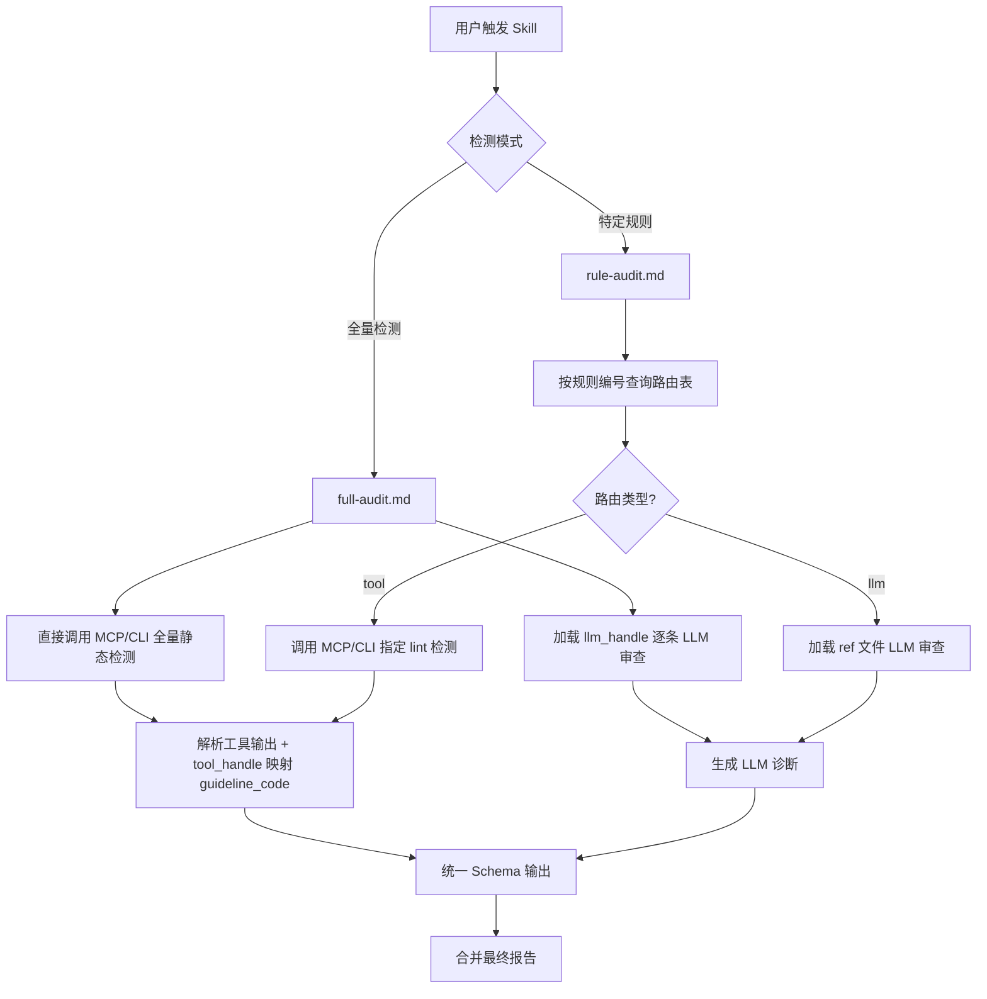

# Rust Coding Guidelines Skills 架构设计

> 基于 [idea.md](../idea.md) 的设计构想，构建一套 **静态工具 + LLM 辅助检测** 的 Rust 编程规范检查 Skills 体系。

---

## 1. 整体架构

### 1.1 核心理念

将 57 条 Rust 编程规范分为三层处理：

| 层级 | 处理方式 | 条目数 | 说明 |
|------|---------|--------|------|
| **Tool 层** | `guidelines_runner` 静态检测 | 37 条 | 21 Clippy 原生 + 16 Fork 自定义 |
| **LLM 层** | 大模型代码审查 | 9 条 | 工具无法覆盖的规则类条目 |
| **排除层** | 不检测 | 11 条 | 原则类条目，仅作参考 |

### 1.2 工作流概览



---

## 2. 目录结构

```
guideline-skills/
├── skills/
│   ├── full-audit/
│   │   ├── SKILL.md                   # 全量检测 skill
│   │   ├── assets/                    # 资源文件（实际存放位置）
│   │   │   ├── tool_handle.json       # 静态工具路由表 - 37 条规则
│   │   │   ├── llm_handle.json        # LLM 处理路由表 - 9 条规则
│   │   │   └── output_schema.json     # 统一输出 schema 定义
│   │   └── refs/                      # 参考文件（实际存放位置）
│   │       ├── rust_coding_guidelines.md # 完整的 Rust 编程规范文档（通用参考）
│   │       ├── G.CMT.02.md            # 文件头注释应包含版权说明
│   │       ├── G.FMT.01.md            # extern 外部函数应显式指定 ABI 标识
│   │       ├── G.TYP.BOL.03.md        # && 和 || 右侧不应包含副作用
│   │       ├── G.TYP.SCT.01.md        # 外部使用的自定义类型宜实现常见 trait
│   │       ├── G.CTF.01.md            # 宜优先使用模式匹配而非判断后再取值
│   │       ├── G.CTF.02.md            # Match Guard 中不应使用带副作用的条件表达式
│   │       ├── G.MAC.DCL.01.md        # 宏匹配规则应遵从匹配范围从小至大
│   │       ├── G.MAC.PRO.011.md       # 不应通过过程宏将 unsafe 包装为 safe
│   │       └── G.SAF.MEM.04.md        # 敏感信息使用完毕后应立即清零
│   └── rule-audit/
│       ├── SKILL.md                   # 特定规则检测 skill
│       ├── assets -> ../full-audit/assets  # 符号链接（指向 full-audit 的资源文件）
│       └── refs -> ../full-audit/refs      # 符号链接（指向 full-audit 的参考文件）
├── plans/                             # 规划文档（已有）
│   ├── architecture.md                # 本文档
│   └── data/                          # 参考数据（已有）
└── idea.md                            # 原始构想
```

---

## 3. 路由表设计

### 3.1 tool_handle.json 结构

静态工具路由表，包含 37 条可由 `guidelines_runner` 检测的规则：

```json
{
  "version": "1.0",
  "description": "静态工具检测路由表 - guidelines_runner / clippy",
  "rules": [
    {
      "guideline_code": "G.NAM.01",
      "title": "应使用统一的命名风格",
      "level": "suggestion",
      "source": "clippy_native",
      "lint_codes": [
        "non_camel_case_types",
        "non_snake_case",
        "non_upper_case_globals"
      ],
      "handler": "tool"
    },
    {
      "guideline_code": "G.NAM.02",
      "title": "类型转换函数命名宜遵循所有权语义",
      "level": "suggestion",
      "source": "clippy_native",
      "lint_codes": ["clippy::wrong_self_convention"],
      "handler": "tool"
    }
  ]
}
```

**字段说明：**

| 字段 | 类型 | 说明 |
|------|------|------|
| `guideline_code` | string | 规范编号，如 `G.NAM.01` |
| `title` | string | 规范标题 |
| `level` | string | 级别：`requirement` 或 `suggestion` |
| `source` | string | 实现来源：`clippy_native` / `fork_custom` |
| `lint_codes` | string[] | 对应的 clippy/rustc lint 代码列表 |
| `handler` | string | 固定为 `tool` |

### 3.2 llm_handle.json 结构

LLM 处理路由表，包含 9 条需要大模型检测的规则：

```json
{
  "version": "1.0",
  "description": "LLM 辅助检测路由表 - 工具无法覆盖的规则",
  "rules": [
    {
      "guideline_code": "G.CMT.02",
      "title": "文件头注释应包含版权说明",
      "level": "suggestion",
      "difficulty": "medium",
      "handler": "llm",
      "ref_file": "refs/G.CMT.02.md",
      "check_strategy": "file_header_scan",
      "check_description": "检查每个 .rs 文件的头部是否包含版权声明注释，格式应统一"
    },
    {
      "guideline_code": "G.FMT.01",
      "title": "extern 外部函数应显式指定 ABI 标识",
      "level": "suggestion",
      "difficulty": "low",
      "handler": "llm",
      "ref_file": "refs/G.FMT.01.md",
      "check_strategy": "pattern_review",
      "check_description": "检查 extern 函数声明是否显式指定了 ABI，如 extern C fn"
    },
    {
      "guideline_code": "G.TYP.BOL.03",
      "title": "&& 和 || 操作符的右侧操作中不应包含副作用",
      "level": "suggestion",
      "difficulty": "high",
      "handler": "llm",
      "ref_file": "refs/G.TYP.BOL.03.md",
      "check_strategy": "semantic_analysis",
      "check_description": "分析 && 和 || 右侧表达式是否包含函数调用、赋值等副作用操作"
    },
    {
      "guideline_code": "G.TYP.SCT.01",
      "title": "外部使用的自定义类型宜实现常见 trait",
      "level": "suggestion",
      "difficulty": "medium",
      "handler": "llm",
      "ref_file": "refs/G.TYP.SCT.01.md",
      "check_strategy": "trait_completeness",
      "check_description": "检查 pub struct/enum 是否实现了 Debug, Clone, PartialEq 等常见 trait"
    },
    {
      "guideline_code": "G.CTF.01",
      "title": "宜优先使用模式匹配而非判断后再取值",
      "level": "suggestion",
      "difficulty": "high",
      "handler": "llm",
      "ref_file": "refs/G.CTF.01.md",
      "check_strategy": "pattern_review",
      "check_description": "识别 is_some/unwrap、is_empty/index 等可用 if let/match 替代的模式"
    },
    {
      "guideline_code": "G.CTF.02",
      "title": "Match Guard 中不应使用带副作用的条件表达式",
      "level": "suggestion",
      "difficulty": "high",
      "handler": "llm",
      "ref_file": "refs/G.CTF.02.md",
      "check_strategy": "semantic_analysis",
      "check_description": "检查 match 分支 guard 中是否包含修改状态、IO 操作等副作用"
    },
    {
      "guideline_code": "G.MAC.DCL.01",
      "title": "编写宏匹配规则时，宜遵从匹配范围从小至大的顺序",
      "level": "suggestion",
      "difficulty": "high",
      "handler": "llm",
      "ref_file": "refs/G.MAC.DCL.01.md",
      "check_strategy": "macro_analysis",
      "check_description": "分析 macro_rules! 中多个匹配分支的片段说明符范围是否从小到大排列"
    },
    {
      "guideline_code": "G.MAC.PRO.011",
      "title": "不应通过过程宏将 unsafe 代码包装为 safe 代码",
      "level": "requirement",
      "difficulty": "medium",
      "handler": "llm",
      "ref_file": "refs/G.MAC.PRO.011.md",
      "check_strategy": "unsafe_wrapper_detection",
      "check_description": "检查过程宏生成的代码中是否将 unsafe 块包装在 safe 函数内而未标记 unsafe"
    },
    {
      "guideline_code": "G.SAF.MEM.04",
      "title": "内存中的敏感信息使用完毕后应立即清零",
      "level": "requirement",
      "difficulty": "high",
      "handler": "llm",
      "ref_file": "refs/G.SAF.MEM.04.md",
      "check_strategy": "sensitive_data_review",
      "check_description": "识别密码、密钥等敏感数据变量，检查是否在 Drop 或使用后通过 write_volatile 等方式清零"
    }
  ]
}
```

**字段说明：**

| 字段 | 类型 | 说明 |
|------|------|------|
| `guideline_code` | string | 规范编号 |
| `title` | string | 规范标题 |
| `level` | string | 级别：`requirement` / `suggestion` |
| `difficulty` | string | 检测难度：`low` / `medium` / `high` |
| `handler` | string | 固定为 `llm` |
| `ref_file` | string | 参考规范文件的相对路径 |
| `check_strategy` | string | 检查策略标识 |
| `check_description` | string | 给 LLM 的检查指令描述 |

---

## 4. 统一输出 Schema

所有检测结果（无论来自 Tool 还是 LLM）统一输出为以下 JSON 格式：

```json
{
  "$schema": "http://json-schema.org/draft-07/schema#",
  "title": "Rust Guidelines Check Report",
  "type": "object",
  "required": ["projectPath", "summary", "diagnostics"],
  "properties": {
    "projectPath": {
      "type": "string",
      "description": "被检测项目的绝对路径"
    },
    "checkMode": {
      "type": "string",
      "enum": ["full", "specific"],
      "description": "检测模式：full=全量 / specific=特定规则"
    },
    "checkedRules": {
      "type": "array",
      "items": { "type": "string" },
      "description": "本次检测涉及的规范编号列表"
    },
    "summary": {
      "type": "object",
      "required": ["total", "errors", "warnings"],
      "properties": {
        "total": { "type": "integer", "description": "诊断总数" },
        "errors": { "type": "integer", "description": "错误数" },
        "warnings": { "type": "integer", "description": "警告数" },
        "tool_diagnostics": { "type": "integer", "description": "工具检测出的诊断数" },
        "llm_diagnostics": { "type": "integer", "description": "LLM 检测出的诊断数" }
      }
    },
    "diagnostics": {
      "type": "array",
      "items": {
        "type": "object",
        "required": ["level", "code", "message", "file", "line"],
        "properties": {
          "level": {
            "type": "string",
            "enum": ["error", "warning", "note"],
            "description": "诊断级别"
          },
          "code": {
            "type": "string",
            "description": "lint 代码，如 clippy::collapsible_if"
          },
          "guideline_code": {
            "type": "string",
            "description": "对应的规范编号，如 G.NAM.01"
          },
          "source": {
            "type": "string",
            "enum": ["tool", "llm"],
            "description": "诊断来源：tool=静态工具 / llm=大模型"
          },
          "message": {
            "type": "string",
            "description": "诊断消息"
          },
          "file": {
            "type": "string",
            "description": "文件相对路径"
          },
          "line": {
            "type": "integer",
            "description": "行号"
          },
          "column": {
            "type": "integer",
            "description": "列号"
          },
          "rendered": {
            "type": "string",
            "description": "格式化的完整诊断输出（主要用于 tool 来源）"
          },
          "suggestions": {
            "type": "array",
            "description": "修复建议",
            "items": {
              "type": "object",
              "properties": {
                "file": { "type": "string" },
                "line_start": { "type": "integer" },
                "line_end": { "type": "integer" },
                "column_start": { "type": "integer" },
                "column_end": { "type": "integer" },
                "replacement": { "type": "string" },
                "applicability": {
                  "type": "string",
                  "enum": ["MachineApplicable", "MaybeIncorrect", "HasPlaceholders", "Unspecified"]
                }
              }
            }
          }
        }
      }
    }
  }
}
```

**相比原始 schema 的增强：**
- 新增 `checkMode` 字段标识检测模式
- 新增 `checkedRules` 字段记录本次检测的规范列表
- 新增 `guideline_code` 字段将 lint 映射回规范编号
- 新增 `source` 字段区分诊断来源（tool/llm）
- `summary` 中新增 `tool_diagnostics` 和 `llm_diagnostics` 分类统计

---

## 5. Skill 工作流设计

### 5.1 full-audit — 全量检测

**触发方式：** 用户请求对整个 Rust 项目进行完整规范检查

**工作流步骤：**

1. **环境准备**
   - 确认目标项目路径
   - 验证 `guidelines_runner` 工具链已注册

2. **Tool 层检测**（37 条规则）
   - 通过 MCP Server 或 CLI 直接调用 `guidelines_runner`，执行全量 lint 检测
   - 工具会自动跑完所有它支持的 lint（无需查询 `tool_handle.json`）
   - 解析工具输出的 JSON 结果
   - 利用 `tool_handle.json` 将 lint code 反查映射到 `guideline_code`，补充到诊断条目中

3. **LLM 层检测**（9 条规则）— 详见 [5.3 LLM 检测优化策略](#53-llm-检测优化策略)
   - 按规则的 `pre_filter` 预过滤，缩小待审查文件和代码范围
   - 分批送入 LLM 审查，每批附带对应的 ref 参考文件
   - 维护文件检查进度追踪，确保全覆盖
   - 生成符合统一 schema 的诊断条目

4. **结果合并与输出**
   - 合并 Tool 和 LLM 的诊断结果
   - 计算 summary 统计
   - 输出统一 JSON 报告

> **说明：** `tool_handle.json` 在 full-audit 中仅用于结果映射（lint code → guideline code），不用于控制检测范围。`guidelines_runner` 本身会执行所有已注册的 lint 规则。

### 5.2 rule-audit — 特定规则检测

**触发方式：** 用户指定一个或多个规范编号进行检查

**工作流步骤：**

1. **规则解析**
   - 接收用户指定的规范编号列表（如 `G.CMT.02, G.NAM.01`）
   - 在 `tool_handle.json` 和 `llm_handle.json` 中查找对应条目
   - 分类为 tool 组和 llm 组

2. **按组执行检测**
   - **tool 组**：调用 `guidelines_runner`，仅启用对应的 lint codes
   - **llm 组**：加载对应 ref 文件，执行针对性代码审查

3. **结果输出**
   - 合并结果，`checkMode` 标记为 `specific`
   - `checkedRules` 列出本次检测的规范编号

### 5.3 LLM 检测优化策略

LLM 检查全量文件面临两个核心挑战：**覆盖率**（确保每个文件都被检查到）和**效率**（避免将大量无关代码送入 LLM）。采用 **"预过滤 → 分批审查 → 进度追踪"** 三阶段策略。

#### 5.3.1 整体流程

```mermaid
flowchart TD
    A[收集项目全部 .rs 文件列表] --> B[按规则分组预过滤]
    B --> C{每条 LLM 规则}
    
    C --> D1[G.CMT.02: 提取每个文件前 10 行]
    C --> D2[G.FMT.01: grep extern fn 相关文件]
    C --> D3[G.TYP.BOL.03: grep && 和 || 相关文件]
    C --> D4[其他规则: 按 pre_filter 过滤]
    
    D1 --> E[分批送入 LLM 审查]
    D2 --> E
    D3 --> E
    D4 --> E
    
    E --> F[记录已检查文件 + 诊断结果]
    F --> G{全部文件已覆盖?}
    G -->|否| E
    G -->|是| H[输出该规则的诊断列表]
```

#### 5.3.2 预过滤策略

每条 LLM 规则配置 `pre_filter` 字段，在送入 LLM 之前通过文本搜索/正则匹配大幅缩小审查范围：

| 规则 | pre_filter 策略 | 送入 LLM 的内容 | 预期过滤率 |
|------|----------------|----------------|-----------|
| G.CMT.02 文件头版权 | 提取每个文件前 10 行 | 文件头片段 | ~90%（仅送头部） |
| G.FMT.01 extern ABI | `grep -rn "extern\s+fn\|extern\s*{"` | 匹配行及上下文 | ~95% |
| G.TYP.BOL.03 短路副作用 | `grep -rn "&&\|\\|\\|"` | 匹配行及函数上下文 | ~80% |
| G.TYP.SCT.01 常见 trait | `grep -rn "pub struct\|pub enum"` | 类型定义及其 impl 块 | ~85% |
| G.CTF.01 模式匹配 | `grep -rn "is_some\|is_none\|unwrap\|is_empty"` | 匹配行及函数上下文 | ~85% |
| G.CTF.02 Match Guard | `grep -rn "match "` + 含 `if` 的分支 | match 块 | ~90% |
| G.MAC.DCL.01 宏匹配顺序 | `grep -rn "macro_rules!"` | 宏定义块 | ~95% |
| G.MAC.PRO.011 过程宏 unsafe | 仅扫描 proc-macro 类型 crate | 过程宏源码 | ~95% |
| G.SAF.MEM.04 敏感信息清零 | `grep -rn "password\|secret\|key\|token\|credential"` | 匹配行及结构体/函数上下文 | ~90% |

#### 5.3.3 分批审查机制

为避免单次 LLM 调用上下文过长导致遗漏或质量下降：

1. **按文件分批**：每批最多包含 5-10 个文件的相关代码片段
2. **上下文控制**：每批总 token 数控制在合理范围内（建议 < 8000 tokens 代码内容）
3. **规则聚焦**：每批只检查一条规则，附带该规则的 ref 参考文件作为 system context
4. **结构化输出**：要求 LLM 按固定格式输出诊断，便于解析合并

**单批审查的 prompt 结构：**
```
[System] 你是 Rust 编程规范审查员。请根据以下规范要求审查代码。

[规范参考] {ref 文件内容}

[待审查代码]
--- 文件: src/foo.rs ---
{预过滤后的代码片段}
--- 文件: src/bar.rs ---
{预过滤后的代码片段}

[输出要求] 按以下 JSON 格式输出发现的问题...
```

#### 5.3.4 进度追踪与全覆盖保证

为确保每个文件都被检查到：

1. **文件清单初始化**：扫描项目获取全部 `.rs` 文件列表
2. **检查矩阵**：维护 `文件 × 规则` 的检查状态矩阵
3. **逐批标记**：每批审查完成后，标记对应文件+规则为"已检查"
4. **完成验证**：所有规则的所有相关文件（经预过滤后）都标记为已检查后，才算完成
5. **跳过标记**：预过滤后无匹配内容的文件，直接标记为"已检查-无需审查"

**检查矩阵示例：**
```
              G.CMT.02  G.FMT.01  G.CTF.01  ...
src/main.rs      ✅        ⬜        ✅
src/lib.rs       ✅        ✅        ⬜
src/utils.rs     ✅        ➖        ✅
...
✅ = 已检查  ⬜ = 待检查  ➖ = 无需审查（预过滤无匹配）
```

#### 5.3.5 llm_handle.json 增强字段

在原有 `llm_handle.json` 基础上，为每条规则增加 `pre_filter` 配置：

```json
{
  "guideline_code": "G.CMT.02",
  "title": "文件头注释应包含版权说明",
  "handler": "llm",
  "ref_file": "refs/G.CMT.02.md",
  "check_strategy": "file_header_scan",
  "check_description": "检查每个 .rs 文件的头部是否包含版权声明注释",
  "pre_filter": {
    "type": "head",
    "lines": 10,
    "description": "提取每个 .rs 文件的前 10 行"
  },
  "batch_size": 20
}
```

```json
{
  "guideline_code": "G.CTF.01",
  "title": "宜优先使用模式匹配而非判断后再取值",
  "handler": "llm",
  "ref_file": "refs/G.CTF.01.md",
  "check_strategy": "pattern_review",
  "check_description": "识别 is_some/unwrap 等可用 if let/match 替代的模式",
  "pre_filter": {
    "type": "grep",
    "patterns": ["is_some\\(\\)", "is_none\\(\\)", "\\.unwrap\\(\\)", "is_empty\\(\\)"],
    "context_lines": 10,
    "description": "搜索包含 is_some/is_none/unwrap/is_empty 调用的文件"
  },
  "batch_size": 8
}
```

**`pre_filter` 类型说明：**

| type | 说明 | 参数 |
|------|------|------|
| `head` | 提取文件头部 N 行 | `lines`: 行数 |
| `grep` | 正则搜索匹配文件 | `patterns`: 正则列表, `context_lines`: 上下文行数 |
| `crate_type` | 按 crate 类型过滤 | `types`: crate 类型列表 |
| `ast_pattern` | 按语法结构过滤 | `patterns`: 语法模式描述 |

---

## 6. refs 参考文件设计

`full-audit/refs/` 目录包含两类参考文件（`rule-audit/refs/` 通过符号链接指向同一目录）：

### 6.1 完整规范文档

- `full-audit/refs/rust_coding_guidelines.md` — 完整的 Rust 编程规范文档，作为 LLM 审查时的通用参考上下文。从 `plans/data/rust_coding_guidelines.md` 复制而来。

### 6.2 LLM 规则专项参考文件

每个 LLM 检测规则对应一个 `.md` 参考文件，结构如下：

```markdown
# G.CMT.02 文件头注释应包含版权说明

## 级别
建议

## 规范描述
文件头注释应首先包含版权说明...

## 检查要点
- 每个 .rs 文件顶部是否有版权注释
- 版权注释格式是否统一
- 是否包含必要的版权信息字段

## 正例
...代码示例...

## 反例
...代码示例...

## 检查指令
扫描项目中所有 .rs 文件，检查文件头部前 N 行是否包含符合规范的版权声明注释。
```

**设计原则：**
- `rust_coding_guidelines.md` 提供完整规范上下文，LLM 可在需要时参考全文
- 每个 `G.*.md` 文件从完整规范中提取对应规则的详细描述
- 增加 **检查要点** 和 **检查指令** 部分，为 LLM 提供明确的审查方向
- 包含正例和反例，帮助 LLM 理解判断标准

---

## 7. MCP Server 集成

### 7.1 调用方式

```json
{
  "mcpServers": {
    "rust-guidelines": {
      "command": "npx",
      "args": ["-y", "rust-guidelines-mcp-server"]
    }
  }
}
```

### 7.2 在 Skill 中的使用

- **full-audit**：调用 MCP 的 `check_project` 工具，传入项目路径，获取全量检测结果
- **rule-audit**：调用 MCP 的 `check_project` 工具，可能需要传入特定 lint 过滤参数
- 如果 MCP 不可用，回退到 CLI 方式：`cargo +guidelines_runner clippy --message-format=json`

---

## 8. 规则覆盖总览

| 分类 | 条目数 | 处理方式 | 路由表 |
|------|--------|---------|--------|
| 🟢 Clippy 原生规则 | 21 | `guidelines_runner` 静态检测 | `tool_handle.json` |
| 🔵 Fork 自定义规则 | 16 | `guidelines_runner` 静态检测 | `tool_handle.json` |
| 🔴 未实现规则 | 9 | LLM 代码审查 | `llm_handle.json` |
| ⚪ 原则类条目 | 11 | 不检测 | 无 |
| **合计** | **57** | — | — |

---

## 9. 实施计划

按以下顺序创建文件：

1. 创建 `skills/full-audit/assets/output_schema.json` — 统一输出 schema
2. 创建 `skills/full-audit/assets/tool_handle.json` — 37 条工具路由表（完整数据）
3. 创建 `skills/full-audit/assets/llm_handle.json` — 9 条 LLM 路由表（完整数据）
4. 复制完整规范文档到 `skills/full-audit/refs/rust_coding_guidelines.md`
5. 创建 `skills/full-audit/refs/` 下 9 个 LLM 规则专项参考文件
6. 创建 `skills/full-audit/SKILL.md` — 全量检测 skill
7. 创建 `skills/rule-audit/SKILL.md` — 特定规则检测 skill
8. 在 `skills/rule-audit/` 下创建符号链接 `assets` → `../full-audit/assets`，`refs` → `../full-audit/refs`
9. 验证与测试
