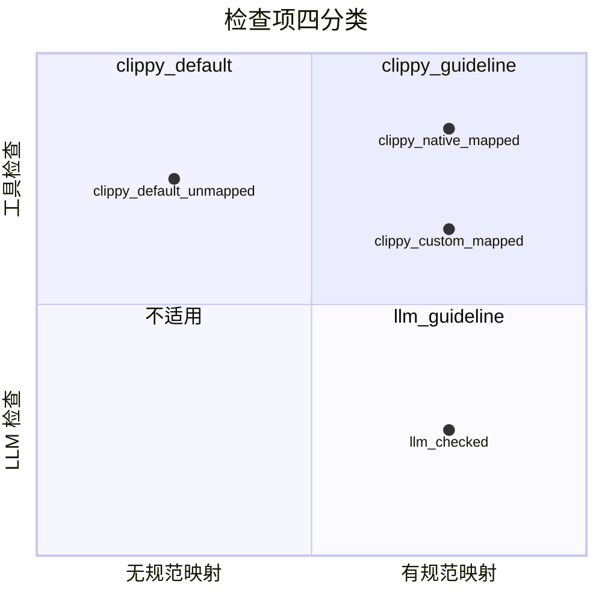
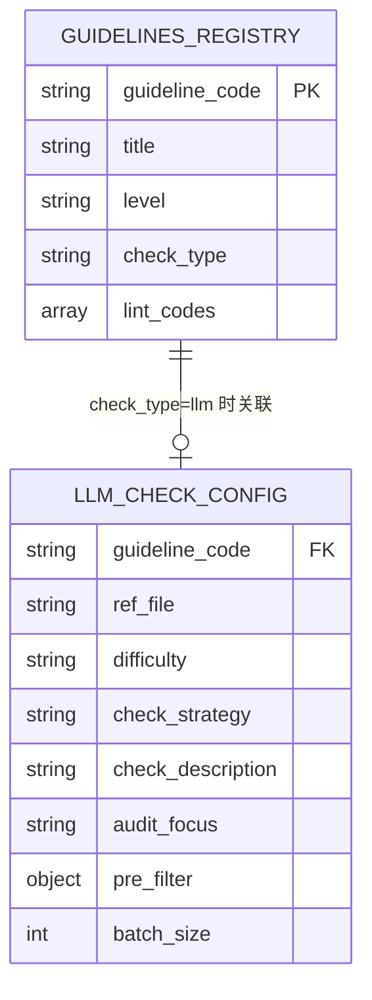
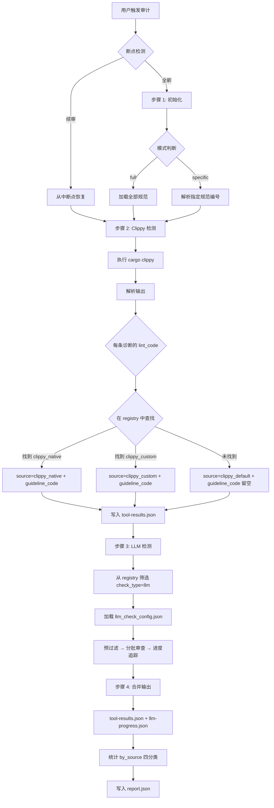

# Rust Coding Guidelines Audit — 重新设计方案

> 基于对当前设计问题的分析，重新设计检查分类体系、路由表结构和工作流。

---

## 1. 当前设计问题分析

### 1.1 核心问题：分类模型与现实不匹配

当前设计采用**二层模型**（Tool 层 vs LLM 层），用 `source` 字段做三分类（`tool_native` / `clippy_custom` / `llm`）。但实际检查场景有 **四种不同的 lint 关系**：

| # | 实际场景 | 当前处理方式 | 问题 |
|---|---------|-------------|------|
| ① | 一个规范对应多个 clippy lint | `tool_handle.json` 中 `lint_codes` 为数组 | 映射方向是 guideline→lints，但运行时需要 lint→guideline 反查，一个 lint 只能属于一个 guideline |
| ② | clippy 默认 lint 无对应规范 | `guideline_code` 留空，`source = tool_native` | 与有规范映射的 `tool_native` 混在一起，无法区分"有规范支撑"和"仅 clippy 默认" |
| ③ | 规范有 → 通过扩展工具的自定义 lint 检查 | `source = clippy_custom`，需 `-W` 显式启用 | 命名不一致：architecture.md 用 `fork_custom` / `tool_custom`，SKILL.md 用 `clippy_custom` |
| ④ | 规范有，工具无法检查 → LLM 检查 | `llm_handle.json` 单独路由 | 设计合理，但与 Tool 层完全割裂，无法统一查询某个规范的检查方式 |

### 1.2 具体问题清单

1. **命名不一致**：`source` 字段在不同文件中有不同命名（`clippy_custom` vs `fork_custom` vs `tool_custom`）
2. **缺乏统一规范注册表**：规范信息分散在 `tool_handle.json` 和 `llm_handle.json` 中，无法一处查看所有规范及其检查方式
3. **clippy 默认 lint 定位模糊**：场景②的 lint 与场景①的 lint 共用 `tool_native` source，消费者无法区分
4. **G.FMT.01 与 G.SAF.FFI.05 的关系**：两条不同规范，`G.FMT.01` 用 LLM 检查，`G.SAF.FFI.05` 用 `clippy::implicit_abi` 工具检查，各自独立但容易混淆
5. **路由表缺乏"检查方法"维度**：当前按"谁来检查"分文件（tool vs llm），但缺少对"一个规范可能同时需要 tool + llm"的支持能力

---

## 2. 重新设计：四分类模型

### 2.1 新的分类体系

将所有检查项分为 **四个类别**（check_type），以"检查来源"和"是否有规范映射"为两个维度：



| check_type | 含义 | 有 guideline_code | 检查方式 | 需要 -W 启用 |
|------------|------|-------------------|---------|-------------|
| `clippy_default` | clippy 默认启用的 lint，无规范映射 | ❌ 留空 | 工具自动检出 | ❌ |
| `clippy_native` | clippy 原生 lint，有规范映射 | ✅ | 工具自动检出 | ❌ |
| `clippy_custom` | 扩展工具自定义 lint，有规范映射 | ✅ | 工具检出，需 -W 启用 | ✅ |
| `llm` | 工具无法检查，LLM 审查 | ✅ | LLM 代码审查 | — |

> **关键变化**：将原来的 `tool_native` 拆分为 `clippy_default`（无规范映射）和 `clippy_native`（有规范映射），消除歧义。

### 2.2 与当前设计的对比

| 维度 | 当前设计 | 新设计 |
|------|---------|--------|
| 分类数 | 3（tool_native / clippy_custom / llm） | 4（clippy_default / clippy_native / clippy_custom / llm） |
| 路由表 | 2 个文件（tool_handle / llm_handle） | 1 个统一注册表 + 1 个 LLM 配置表 |
| 规范查询 | 需查两个文件 | 统一注册表一处查询 |
| 默认 lint 定位 | 与有映射的 native lint 混合 | 独立类别 `clippy_default` |
| 命名一致性 | 不一致 | 统一 |

---

## 3. 新的路由表设计

### 3.1 统一规范注册表：`guidelines_registry.json`

**替代原来的 `tool_handle.json`**，作为所有规范条目的唯一注册中心。

```json
{
  "version": "2.0",
  "description": "Rust 编程规范统一注册表 — 所有规范条目及其检查方式",
  "guidelines": [
    {
      "guideline_code": "G.NAM.01",
      "title": "应使用统一的命名风格",
      "level": "suggestion",
      "check_type": "clippy_native",
      "lint_codes": ["non_camel_case_types", "non_snake_case", "non_upper_case_globals"]
    },
    {
      "guideline_code": "G.TYP.01",
      "title": "数值字面量要添加明确的类型标识",
      "level": "suggestion",
      "check_type": "clippy_custom",
      "lint_codes": ["clippy::unconstrained_numeric_literal"]
    },
    {
      "guideline_code": "G.CMT.02",
      "title": "文件头注释应包含版权说明",
      "level": "suggestion",
      "check_type": "llm",
      "lint_codes": []
    },
    {
      "guideline_code": "G.FMT.01",
      "title": "extern 外部函数应显式指定 ABI 标识",
      "level": "requirement",
      "check_type": "llm",
      "lint_codes": []
    }
  ]
}
```

**字段说明：**

| 字段 | 类型 | 说明 |
|------|------|------|
| `guideline_code` | string | 规范编号（唯一标识） |
| `title` | string | 规范标题 |
| `level` | `requirement` \| `suggestion` | 规范级别 |
| `check_type` | `clippy_native` \| `clippy_custom` \| `llm` | 检查方式 |
| `lint_codes` | string[] | 对应的 lint 代码列表（`llm` 类型为空数组） |

> **注意**：`clippy_default` 不在此表中注册，因为它们没有规范映射，是运行时从 clippy 输出中动态识别的。

### 3.2 LLM 检查配置表：`llm_check_config.json`

**替代原来的 `llm_handle.json`**，仅包含 LLM 检查所需的额外配置（预过滤、批次大小等）。

```json
{
  "version": "2.0",
  "description": "LLM 检查配置 — 仅包含 check_type=llm 的规则的检查参数",
  "checks": [
    {
      "guideline_code": "G.CMT.02",
      "ref_file": "refs/G.CMT.02.md",
      "difficulty": "medium",
      "check_strategy": "file_header_scan",
      "check_description": "检查每个 .rs 文件的头部是否包含版权声明注释",
      "audit_focus": "文件头部是否包含版权声明注释",
      "pre_filter": {
        "type": "head",
        "lines": 10
      },
      "batch_size": 20
    }
  ]
}
```

> `llm_check_config.json` 中的 `guideline_code` 必须在 `guidelines_registry.json` 中存在且 `check_type = "llm"`。这是一个**引用关系**，不是重复定义。

### 3.3 两表关系



### 3.4 运行时 lint 映射逻辑

运行时从 clippy 输出中获取诊断后，按以下逻辑分类：

```
对每条 clippy 诊断的 lint_code:
  1. 在 guidelines_registry 中查找包含该 lint_code 的条目
  2. 找到且 check_type = clippy_native → 
       source = "clippy_native", guideline_code = 匹配值
  3. 找到且 check_type = clippy_custom → 
       source = "clippy_custom", guideline_code = 匹配值
  4. 未找到 → 
       source = "clippy_default", guideline_code = ""
```

---

## 4. 新的输出 Schema

### 4.1 source 四分类

```json
{
  "source": {
    "type": "string",
    "enum": ["clippy_default", "clippy_native", "clippy_custom", "llm"]
  }
}
```

### 4.2 summary.by_source 更新

```json
{
  "by_source": {
    "clippy_default": 15,
    "clippy_native": 8,
    "clippy_custom": 10,
    "llm": 5
  }
}
```

### 4.3 完整 diagnostics 条目

```json
{
  "level": "warning",
  "code": "clippy::collapsible_if",
  "guideline_code": "",
  "source": "clippy_default",
  "message": "this if statement can be collapsed",
  "file": "src/main.rs",
  "line": 74,
  "column": 5,
  "rendered": "...",
  "suggestions": []
}
```

---

## 5. 新的工作流设计

### 5.1 默认检查（full 模式）执行内容

| 步骤 | 检查内容 | 来源 |
|------|---------|------|
| 1 | clippy 默认 lint（所有默认启用的 warn/deny lint） | clippy 自动输出 |
| 2 | clippy 扩展 lint（`check_type = clippy_custom` 的规则） | 通过 `-W` 参数显式启用 |
| 3 | LLM 检查（`check_type = llm` 的规则） | LLM 代码审查 |

> clippy_native 类型的 lint 包含在步骤 1 中，因为它们是 clippy 默认启用的 lint，只是额外有规范映射。

### 5.2 工作流概览



### 5.3 specific 模式的路由逻辑

用户指定规范编号时：

```
对每个用户指定的 guideline_code:
  1. 在 guidelines_registry.json 中查找
  2. 找到 → 按 check_type 分组:
     - clippy_native / clippy_custom → 加入 tool_group
     - llm → 加入 llm_group
  3. 未找到 → 报告无效编号

tool_group 非空时:
  - clippy_native 类: clippy 默认会检出，无需额外参数
  - clippy_custom 类: 需要 -W 参数启用
  - 过滤 clippy 输出，只保留 tool_group 中规范对应的 lint

llm_group 非空时:
  - 仅执行 llm_group 中的规则
```

> **specific 模式的关键变化**：不再报告 `clippy_default` 类的诊断（因为用户只关心指定的规范）。

---

## 6. 文件结构变更

### 6.1 变更对照

| 当前文件 | 新文件 | 变更说明 |
|---------|--------|---------|
| `assets/tool_handle.json` | `assets/guidelines_registry.json` | 重命名 + 结构重构，包含所有规范条目 |
| `assets/llm_handle.json` | `assets/llm_check_config.json` | 重命名 + 精简，仅保留 LLM 检查配置 |
| `assets/output_schema.json` | `assets/output_schema.json` | 更新 source enum 为四分类 |
| `SKILL.md` | `SKILL.md` | 重写，适配新分类体系 |

### 6.2 新目录结构

```
skills/coding-guidelines-audit/
├── SKILL.md                          # 重写的 Skill 定义
├── assets/
│   ├── guidelines_registry.json      # 统一规范注册表（46 条规范）
│   ├── llm_check_config.json         # LLM 检查配置（8 条 LLM 规则）
│   └── output_schema.json            # 更新的输出 schema（四分类）
└── refs/
    ├── rust_coding_guidelines.md     # 完整规范文档
    ├── G.CMT.02.md                   # LLM 检查参考文件
    ├── G.CTF.01.md
    ├── G.CTF.02.md
    ├── G.MAC.DCL.01.md
    ├── G.MAC.PRO.011.md
    ├── G.SAF.MEM.04.md
    ├── G.TYP.BOL.03.md
    └── G.TYP.SCT.01.md
```

> **注意**：`refs/G.FMT.01.md` 保留（G.FMT.01 仍为 LLM 检查）。LLM 规则从 9 条变为 8 条的情况不会发生，因为 G.FMT.01 和 G.SAF.FFI.05 保持各自独立。

---

## 7. guidelines_registry.json 完整内容设计

### 7.1 clippy_native 类（21 条）

| guideline_code | lint_codes |
|---------------|------------|
| G.NAM.01 | `non_camel_case_types`, `non_snake_case`, `non_upper_case_globals` |
| G.NAM.02 | `clippy::wrong_self_convention` |
| G.CMT.01 | `clippy::missing_errors_doc`, `clippy::missing_panics_doc`, `clippy::missing_safety_doc`, `clippy::undocumented_unsafe_blocks` |
| G.CNS.01 | `clippy::borrow_interior_mutable_const`, `clippy::declare_interior_mutable_const` |
| G.CNS.02 | `clippy::approx_constant` |
| G.TYP.BOL.01 | `clippy::blocks_in_conditions` |
| G.TYP.BOL.02 | `clippy::bool_assert_comparison`, `clippy::bool_comparison` |
| G.TYP.INT.01 | `clippy::arithmetic_side_effects` |
| G.TYP.SLC.01 | `clippy::needless_range_loop` |
| G.TYP.SLC.02 | `unconditional_panic` |
| G.TYP.STR.01 | `clippy::recursive_format_impl` |
| G.TYP.PTR.01 | `clippy::redundant_allocation` |
| G.EXP.01 | `clippy::bad_bit_mask` |
| G.EXP.02 | `clippy::precedence` |
| G.FUD.01 | `clippy::large_types_passed_by_value` |
| G.FUD.02 | `unused_must_use` |
| G.TRA.01 | `clippy::derive_ord_xor_partial_ord` |
| G.TRA.02 | `clippy::from_over_into` |
| G.ERR.01 | `clippy::unwrap_used` |
| G.MOD.01 | `clippy::wildcard_imports` |
| G.SAF.MTH.01 | `clippy::mutex_atomic`, `clippy::mutex_integer` |

### 7.2 clippy_custom 类（16 条）

| guideline_code | lint_codes |
|---------------|------------|
| G.TYP.01 | `clippy::unconstrained_numeric_literal` |
| G.TYP.CHR.01 | `clippy::invalid_char_range` |
| G.CTF.03 | `clippy::infinite_loop` |
| G.SAF.UNS.01 | `clippy::untrusted_lib_loading` |
| G.SAF.FFI.01 | `clippy::passing_string_to_c_functions` |
| G.SAF.FFI.02 | `clippy::extern_without_repr` |
| G.SAF.FFI.03 | `clippy::non_reentrant_functions` |
| G.SAF.FFI.04 | `clippy::mem_unsafe_functions` |
| G.SAF.ASY.01 | `clippy::blocking_op_in_async` |
| G.SAF.MEM.01 | `clippy::fallible_memory_allocation` |
| G.SAF.MEM.02 | `clippy::dangling_ptr_dereference`, `clippy::null_ptr_dereference`, `clippy::return_stack_address` |
| G.SAF.MEM.03 | `clippy::ptr_double_free` |
| G.MAC.01 | `clippy::unsafe_block_in_proc_macro` |
| G.OTH.01 | `clippy::hard_coded_ip` |
| G.SAF.FFI.05 | `clippy::implicit_abi` |
| G.SAF.UNS.02 | `clippy::mut_from_ref` |

### 7.3 llm 类（9 条）

| guideline_code | ref_file |
|---------------|----------|
| G.CMT.02 | refs/G.CMT.02.md |
| G.FMT.01 | refs/G.FMT.01.md |
| G.TYP.BOL.03 | refs/G.TYP.BOL.03.md |
| G.TYP.SCT.01 | refs/G.TYP.SCT.01.md |
| G.CTF.01 | refs/G.CTF.01.md |
| G.CTF.02 | refs/G.CTF.02.md |
| G.MAC.DCL.01 | refs/G.MAC.DCL.01.md |
| G.MAC.PRO.011 | refs/G.MAC.PRO.011.md |
| G.SAF.MEM.04 | refs/G.SAF.MEM.04.md |

---

## 8. 实施步骤

### 8.1 数据文件变更

1. 创建 `assets/guidelines_registry.json`（合并 tool_handle + llm 规范条目，统一 check_type 字段）
2. 创建 `assets/llm_check_config.json`（从 llm_handle.json 提取纯 LLM 配置）
3. 更新 `assets/output_schema.json`（source enum 改为四分类）
4. 删除旧文件 `assets/tool_handle.json` 和 `assets/llm_handle.json`

### 8.2 SKILL.md 重写

1. 更新概述：四分类模型说明
2. 更新资源文件表：新文件名和用途
3. 更新步骤 2（Tool 层检测）：新的映射逻辑（四分类）
4. 更新步骤 3（LLM 层检测）：引用 `llm_check_config.json`
5. 更新步骤 4（结果合并）：`by_source` 四分类统计
6. 更新 CLI 命令示例：`-W` 参数从 `guidelines_registry.json` 中 `check_type = clippy_custom` 的条目动态生成

### 8.3 架构文档更新

1. 更新 `plans/architecture.md`：反映新的四分类设计
2. 更新路由表设计章节
3. 更新诊断来源章节（第 10 节）

---

## 9. 设计决策记录

| 决策 | 理由 |
|------|------|
| `clippy_default` 不在 registry 中注册 | 这些 lint 数量庞大（800+），且无规范映射，运行时动态识别更合理 |
| G.FMT.01 和 G.SAF.FFI.05 保持独立 | 两条规范虽然相关但有细微差别，不合并检查 |
| 统一注册表 + LLM 配置表的两表设计 | 注册表提供统一查询入口，LLM 配置表包含仅 LLM 需要的额外参数，避免冗余 |
| source 从三分类扩展为四分类 | 消除 `tool_native` 的歧义（有映射 vs 无映射），让报告消费者能精确区分 |
| `check_type` 替代 `source` + `handler` | 当前设计中 `source` 和 `handler` 有冗余，统一为 `check_type` 更清晰 |
