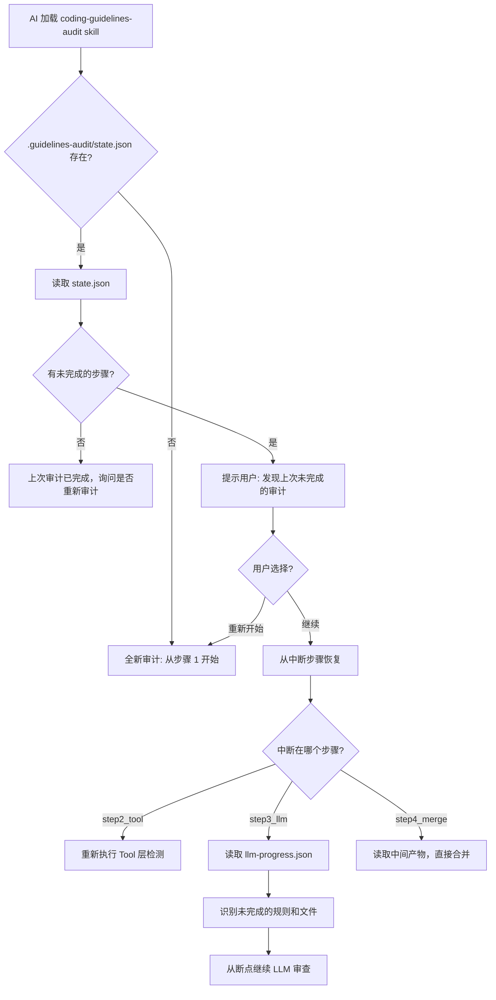
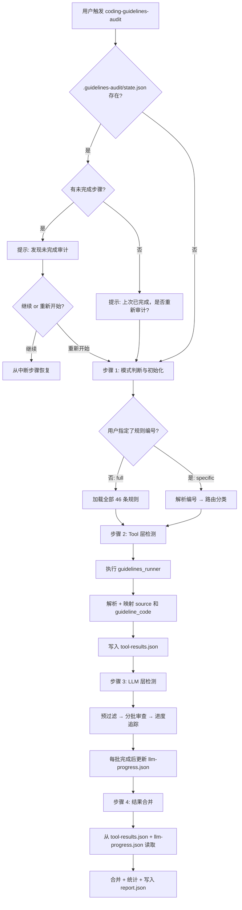
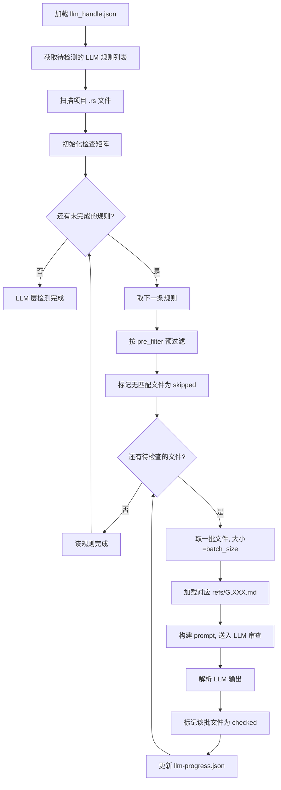

# Skills 重构计划：从第一性原理重构 coding-guidelines-audit

## 1. 现状问题总结

### 1.1 结构冗余
- `full-audit/` 和 `rule-audit/` 本质是同一 skill 的两种参数模式，却拆成了两个独立 skill
- 两个 SKILL.md 共享 ~70% 内容，违反 DRY 原则
- `rule-audit` 多处写"详见 full-audit 步骤 X.X"，承认了重复

### 1.2 符号链接失效
- `rule-audit/assets/` 和 `rule-audit/refs/` 下的文件内容是路径字符串（如 `../../full-audit/refs/G.CMT.02.md`），不是真正的 OS 符号链接
- AI 读取这些文件时得到的是路径字符串而非实际内容，导致 skill 无法正常工作

### 1.3 SKILL.md 过长
- `full-audit/SKILL.md` 438 行，`rule-audit/SKILL.md` 468 行
- 大量篇幅用于描述示例、注意事项等非核心内容，关键步骤被稀释

### 1.4 空目录残留
- `skills/audit/` 目录仅含空的 `assets/` 和 `refs/`，无实际内容

### 1.5 诊断来源区分不足
- 现有 `source` 字段仅区分 `tool` 和 `llm`，无法区分 clippy 原生 lint 和 fork 自定义 lint
- `tool_handle.json` 中已有 `source: "clippy_native" | "fork_custom"` 字段，但未传递到最终报告
- 标准 clippy lint（不在 tool_handle 映射表中的）缺乏明确的处理说明

### 1.6 可靠性缺失
- LLM 无记忆，长链路审计过程中断后无法恢复
- 无中间产物持久化，所有工作在 LLM 上下文中断时全部丢失
- LLM 层的检查矩阵仅存在于 SKILL.md 的描述中，未要求实际写入文件

---

## 2. 重构目标

1. **合并为单一 Skill** — 消除重复，统一入口 `coding-guidelines-audit`
2. **SKILL.md 精简到 ~250 行** — 聚焦流程逻辑和决策规则，数据外置到 JSON
3. **提升 AI 执行可靠性** — 中间产物持久化，支持断点续审
4. **细化诊断来源分类** — `source` 从二分法（tool/llm）升级为三分法（tool_native/tool_custom/llm）
5. **清理无效文件** — 删除空目录和伪符号链接

---

## 3. 新目录结构

### 3.1 Skill 目录

```
skills/
└── coding-guidelines-audit/
    ├── SKILL.md                    # 统一的审计 skill（~250 行）
    ├── assets/
    │   ├── tool_handle.json        # 37 条静态工具路由表（不变）
    │   ├── llm_handle.json         # 9 条 LLM 检测路由表（增强 audit_focus 字段）
    │   └── output_schema.json      # 统一输出 schema（更新 source 枚举 + summary 结构）
    └── refs/
        ├── rust_coding_guidelines.md  # 完整规范参考
        ├── G.CMT.02.md
        ├── G.CTF.01.md
        ├── G.CTF.02.md
        ├── G.FMT.01.md
        ├── G.MAC.DCL.01.md
        ├── G.MAC.PRO.011.md
        ├── G.SAF.MEM.04.md
        ├── G.TYP.BOL.03.md
        └── G.TYP.SCT.01.md
```

### 3.2 运行时工作目录（在目标项目中生成）

```
<目标项目>/
└── .guidelines-audit/
    ├── state.json              # 审计总状态（断点续审核心）
    ├── tool-results.json       # Tool 层检测结果（步骤 2 产物）
    ├── llm-progress.json       # LLM 层检查进度和中间结果（步骤 3 产物）
    └── report.json             # 最终审计报告（步骤 4 产物）
```

### 3.3 删除的目录
- `skills/full-audit/` — 内容合并到新 skill
- `skills/rule-audit/` — 内容合并到新 skill
- `skills/audit/` — 空目录，直接删除

---

## 4. 诊断来源（source）三层分类设计

### 4.1 分类体系

| source 值 | 含义 | 来源 | guideline_code |
|-----------|------|------|----------------|
| `tool_native` | clippy 原生 lint | guidelines_runner 输出 | 有映射的填写，无映射的留空 |
| `tool_custom` | fork 自定义 lint | guidelines_runner 输出 | 必有映射 |
| `llm` | LLM 代码审查 | AI 审查结果 | 必有映射 |

### 4.2 映射逻辑

```
对于 guidelines_runner 输出的每条诊断:
  1. 用 lint_code 在 tool_handle.json 中查找
  2. 如果找到:
     - guideline_code = 匹配规则的 guideline_code
     - source = 匹配规则的 source 字段映射:
       - "clippy_native" → "tool_native"
       - "fork_custom" → "tool_custom"
  3. 如果未找到（标准 clippy lint）:
     - guideline_code = ""（留空）
     - source = "tool_native"
```

### 4.3 output_schema.json 更新

`source` 字段的 enum 从 `["tool", "llm"]` 更新为 `["tool_native", "tool_custom", "llm"]`。

`summary` 中的统计字段相应调整：

```json
{
  "summary": {
    "total": 30,
    "errors": 2,
    "warnings": 28,
    "by_source": {
      "tool_native": 15,
      "tool_custom": 10,
      "llm": 5
    }
  }
}
```

用 `by_source` 对象替代原来的 `tool_diagnostics` / `llm_diagnostics` 两个扁平字段，更具扩展性。

---

## 5. 中间产物持久化设计（可靠性核心）

### 5.1 设计原则

| 原则 | 说明 |
|------|------|
| **每步写入** | 每个主要步骤完成后立即将结果写入文件 |
| **断点续审** | AI 重新加载时可检测并恢复上次进度 |
| **增量更新** | LLM 层每批审查完成后更新进度文件 |
| **最终合并** | 最终报告从中间产物文件合并生成，而非依赖 LLM 记忆 |

### 5.2 state.json — 审计总状态

```json
{
  "version": "1.0",
  "mode": "full",
  "projectPath": "/path/to/project",
  "startedAt": "2024-01-01T00:00:00Z",
  "updatedAt": "2024-01-01T00:15:00Z",
  "steps": {
    "step1_init": "completed",
    "step2_tool": "completed",
    "step3_llm": "in_progress",
    "step4_merge": "pending"
  },
  "checkedRules": ["G.NAM.01", "G.NAM.02", "G.CMT.02"],
  "config": {
    "specificRules": [],
    "toolGroup": ["G.NAM.01", "G.NAM.02"],
    "llmGroup": ["G.CMT.02"]
  }
}
```

**步骤状态枚举**：`pending` → `in_progress` → `completed` | `failed`

### 5.3 tool-results.json — Tool 层检测结果

步骤 2 完成后写入，包含已解析、已映射的全部 Tool 诊断：

```json
{
  "completedAt": "2024-01-01T00:05:00Z",
  "rawDiagnosticsCount": 25,
  "diagnostics": [
    {
      "level": "warning",
      "code": "clippy::wrong_self_convention",
      "guideline_code": "G.NAM.02",
      "source": "tool_native",
      "message": "methods called to_* usually take self by reference",
      "file": "src/lib.rs",
      "line": 42,
      "column": 5,
      "rendered": "...",
      "suggestions": []
    }
  ]
}
```

### 5.4 llm-progress.json — LLM 层检查进度

步骤 3 过程中**持续更新**，每批审查完成后追加结果：

```json
{
  "updatedAt": "2024-01-01T00:15:00Z",
  "files": ["src/main.rs", "src/lib.rs", "src/utils.rs"],
  "rules": {
    "G.CMT.02": {
      "status": "completed",
      "fileStatus": {
        "src/main.rs": "checked",
        "src/lib.rs": "checked",
        "src/utils.rs": "checked"
      },
      "summary": "3/3 files covered, 2 checked, 1 skipped",
      "diagnostics": [
        {
          "level": "warning",
          "code": "G.CMT.02",
          "guideline_code": "G.CMT.02",
          "source": "llm",
          "message": "文件头部缺少版权声明注释",
          "file": "src/main.rs",
          "line": 1,
          "column": 1,
          "suggestions": []
        }
      ]
    },
    "G.CTF.01": {
      "status": "in_progress",
      "fileStatus": {
        "src/main.rs": "checked",
        "src/lib.rs": "pending",
        "src/utils.rs": "skipped"
      },
      "summary": "1/3 files covered (1 checked, 0 skipped), 2 pending",
      "diagnostics": []
    }
  }
}
```

**fileStatus 枚举**：`pending` → `checked` | `skipped`（预过滤无匹配）

### 5.5 断点续审工作流



### 5.6 SKILL.md 中的持久化指令

在 SKILL.md 的每个步骤中嵌入写入指令：

- **步骤 1 完成后**：创建 `.guidelines-audit/` 目录，写入 `state.json`（steps.step1_init = completed）
- **步骤 2 完成后**：写入 `tool-results.json`，更新 `state.json`（steps.step2_tool = completed）
- **步骤 3 每批完成后**：更新 `llm-progress.json`（追加诊断，更新 fileStatus）
- **步骤 3 全部完成后**：更新 `state.json`（steps.step3_llm = completed）
- **步骤 4 完成后**：写入 `report.json`，更新 `state.json`（steps.step4_merge = completed）

---

## 6. SKILL.md 重构设计

### 6.1 设计原则

| 原则 | 说明 |
|------|------|
| **流程与数据分离** | SKILL.md 描述"怎么做"，JSON 文件描述"做什么" |
| **决策树驱动** | 用清晰的 if/else 逻辑描述模式判断和分支 |
| **步骤可追踪** | 每个步骤有编号，AI 可以报告"正在执行步骤 X" |
| **约束前置** | 关键约束嵌入对应步骤，而非集中在末尾 |
| **产物驱动** | 每步明确要求写入中间产物文件 |

### 6.2 SKILL.md 内容大纲（~250 行目标）

```
---
name: coding-guidelines-audit
description: Rust 编程规范审计 - 支持全量检查和定向规则检查，具备断点续审能力
---

# Rust 编程规范审计

## 概述（~15 行）
- 一句话说明：46 条规范规则 + 标准 clippy lint，双层架构
- 两种模式：full / specific，由输入自动判断
- 三种诊断来源：tool_native / tool_custom / llm
- 中间产物持久化：支持断点续审

## 前置条件（~15 行）
- guidelines_runner 工具链
- MCP Server 配置
- 目标项目路径

## 工作流（~170 行，核心部分）

### 步骤 0: 断点检测（~20 行）
- 检查目标项目中 .guidelines-audit/state.json 是否存在
- 如果存在且有未完成步骤 → 提示用户选择继续或重新开始
- 如果继续 → 跳转到对应步骤
- 如果不存在或重新开始 → 进入步骤 1

### 步骤 1: 模式判断与初始化（~25 行）
- 判断逻辑：有规则编号 → specific，无 → full
- specific 模式：解析编号 → 验证 → 路由分类（tool_group + llm_group）
- 确认项目路径，验证工具链
- 📝 产物：创建 .guidelines-audit/state.json
- ⚠️ 约束：无效编号应报告并继续处理有效编号

### 步骤 2: Tool 层检测（~35 行）
- full 模式：全量执行
- specific 模式：仅启用指定 lint codes（-W 参数）
- MCP 优先（check_project），CLI 回退（cargo +guidelines_runner clippy）
- 输出解析：筛选 compiler-message，提取诊断信息
- guideline_code 映射：查 tool_handle.json
- source 映射：clippy_native → tool_native，fork_custom → tool_custom
- 📝 产物：写入 .guidelines-audit/tool-results.json，更新 state.json
- ⚠️ 约束：未映射的标准 clippy lint 保留，source=tool_native，guideline_code 留空

### 步骤 3: LLM 层检测（~60 行）
- full 模式：全部 9 条 LLM 规则
- specific 模式：仅用户指定的 LLM 规则
- 三阶段策略：
  1. 预过滤：按 llm_handle.json 中的 pre_filter 配置执行
  2. 分批审查：每批单规则 + ref 文件，batch_size 由配置控制
  3. 进度追踪：文件×规则 检查矩阵，确保全覆盖
- prompt 模板（精简版，~15 行）
- 📝 产物：每批完成后更新 .guidelines-audit/llm-progress.json
- 📝 产物：全部完成后更新 state.json
- ⚠️ 约束：每批只聚焦一条规则，不混合
- ⚠️ 约束：断点续审时从 llm-progress.json 恢复，跳过已完成的规则/文件

### 步骤 4: 结果合并与输出（~25 行）
- 从 tool-results.json 读取 Tool 层诊断
- 从 llm-progress.json 读取 LLM 层诊断
- 合并为统一 diagnostics 数组
- 计算 summary（含 by_source 分类统计）
- 汇总 checkedRules
- 设置 checkMode：full 或 specific
- 📝 产物：写入 .guidelines-audit/report.json，更新 state.json
- 输出报告路径给用户

## 关键约束（~10 行）
- 排除 target/ 目录
- MCP 优先，CLI 回退
- Tool 层失败时记录错误并继续 LLM 层
- 最终报告必须从中间产物文件合并生成，不依赖 LLM 记忆
```

### 6.3 与现有设计的关键差异

| 维度 | 现有设计 | 重构后 |
|------|---------|--------|
| Skill 数量 | 2 个独立 skill | 1 个统一 skill |
| 模式判断 | 用户选择不同 skill | 自动判断：有规则编号→specific，无→full |
| SKILL.md 行数 | 438 + 468 = 906 行 | ~250 行 |
| source 分类 | tool / llm（二分） | tool_native / tool_custom / llm（三分） |
| summary 统计 | tool_diagnostics + llm_diagnostics | by_source 对象（三类） |
| 标准 clippy lint | 提及但不明确 | 明确保留，source=tool_native |
| 中间产物 | 无持久化 | 4 个文件，支持断点续审 |
| 断点续审 | 不支持 | 步骤 0 自动检测并恢复 |
| 注意事项 | 集中在文末 10-12 条 | 嵌入对应步骤（⚠️/📝 标记），仅保留全局约束 |
| 预过滤详情 | 完整表格在 SKILL.md | 引用 llm_handle.json 中的 pre_filter 配置 |

---

## 7. 数据文件更新

### 7.1 llm_handle.json 增强

新增 `audit_focus` 字段，一句话描述审查聚焦点：

```json
{
  "guideline_code": "G.CMT.02",
  "audit_focus": "文件头部是否包含版权声明注释"
}
```

### 7.2 output_schema.json 更新

- `source` 枚举：`["tool", "llm"]` → `["tool_native", "tool_custom", "llm"]`
- `summary` 结构：移除 `tool_diagnostics` / `llm_diagnostics`，新增 `by_source` 对象

### 7.3 tool_handle.json

无需修改。已有的 `source: "clippy_native" | "fork_custom"` 字段正好用于映射。

---

## 8. 工作流可视化

### 8.1 主工作流



### 8.2 LLM 层检测详细流程



---

## 9. 实施步骤

### Phase 1: 创建新 skill 目录和文件
1. 创建 `skills/coding-guidelines-audit/` 目录结构（含 `assets/` 和 `refs/`）
2. 复制 `full-audit/assets/tool_handle.json` 到新目录（不修改）
3. 复制 `full-audit/assets/llm_handle.json` 到新目录并增强（添加 `audit_focus` 字段）
4. 复制 `full-audit/assets/output_schema.json` 到新目录并更新（source 枚举 + summary 结构）
5. 复制 `full-audit/refs/` 下所有 .md 文件到新目录（不修改）

### Phase 2: 编写新 SKILL.md
6. 按第 6 节大纲编写统一的 SKILL.md（~250 行），包含：
   - 断点续审逻辑（步骤 0）
   - 统一的模式判断（步骤 1）
   - Tool 层检测 + source 三分类映射（步骤 2）
   - LLM 层检测 + 中间产物持续写入（步骤 3）
   - 从中间产物合并最终报告（步骤 4）

### Phase 3: 清理旧文件
7. 删除 `skills/full-audit/` 目录
8. 删除 `skills/rule-audit/` 目录（含伪符号链接文件）
9. 删除 `skills/audit/` 空目录

### Phase 4: 更新架构文档
10. 更新 `plans/architecture.md` 反映：
    - 新的目录结构
    - source 三分类设计
    - 中间产物持久化设计
    - 断点续审工作流

### Phase 5: 验证
11. 检查新 SKILL.md 中所有文件引用路径正确
12. 确认 refs/ 和 assets/ 下文件完整
13. 验证 output_schema.json 的 source 枚举和 summary 结构一致性
14. 确认中间产物文件的 JSON 结构与 SKILL.md 描述一致
